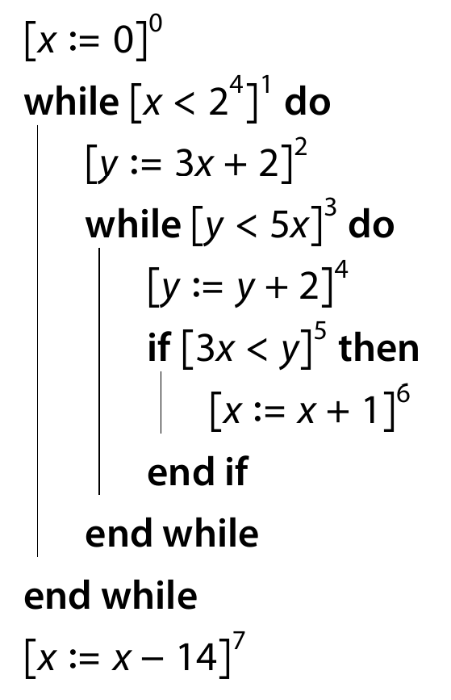
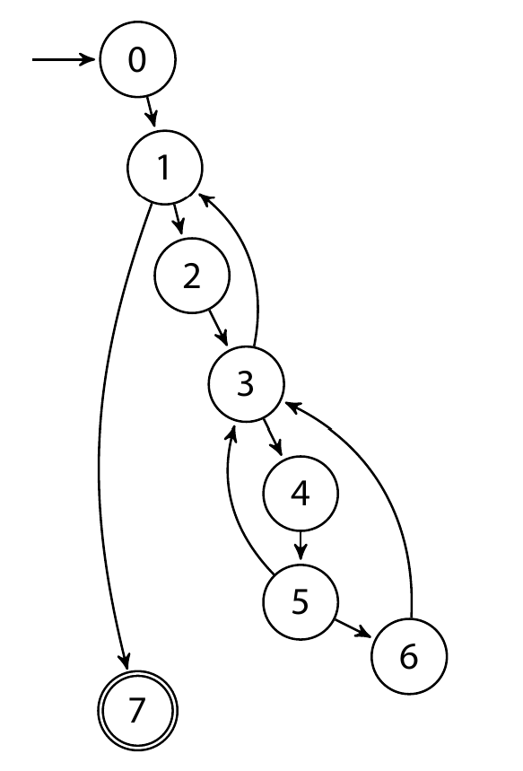

# Reaching Definitions Analysis
Performs a reaching definition analysis for a given labeled program.
## example:
The following program\
\
has the following control flow graph\
\
and is thus encoded as:
```
8                   # number of blocks
x y                 # variables
1 0 1 0 1 0 1 1     # does each block override a variable (0: no, 1: yes)
x - y - y - x x     # which variables are overriden in each block
1                   # blocks that are reachable from block 0
2 7                 # blocks that are reachable from block 1
3                   # blocks that are reachable from block 2
1 4                 # ...
5                   # ...
3 6                 # ...
3                   # ...
-                   # # blocks that are reachable from block 7
```
The program expects data is this format, any changes will break it.
